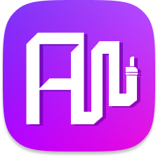

<table align="center" style="border: none; border-collapse: collapse;">
  <tr style="border: none;">
    <td style="border: none; padding: 0;">
      
    </td>
    <td style="border: none; padding-left: 15px;">
      <h1>Auxie</h1>
    </td>
  </tr>
</table>

Planned key features:
- *Democratized queue* - Users vote to skip or like tracks, influencing the playback order in real-time.
- *Granular Role Management* - Dedicated permissions for Host, DJ, and Guest roles.
- *Multi-Platform Integration* - Support for Spotify, SoundCloud, and Tidal in a single unified queue.
- *Real-time Synchronization* - Low-latency updates for all participants using WebSockets.
